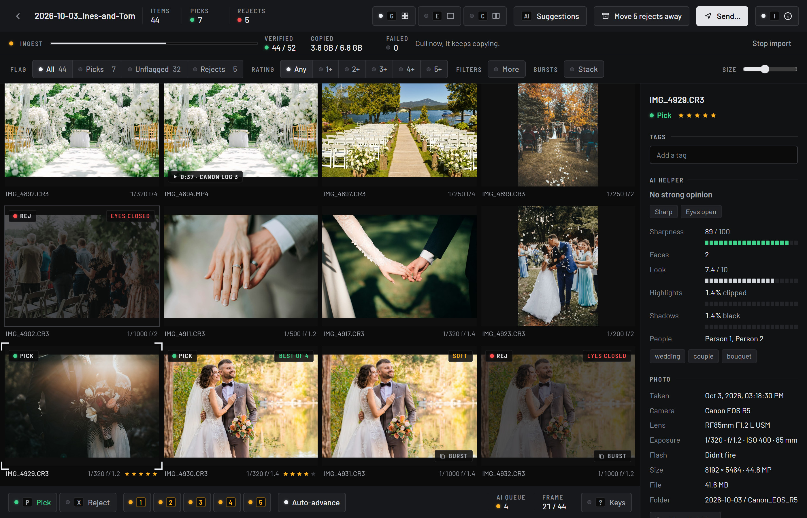

# Safelight

Import, sort and cull photos from camera cards, then hand the keepers to Lightroom Classic or DaVinci Resolve. Runs on Windows and macOS.

https://github.com/user-attachments/assets/d0f81d20-6a10-41ca-89f6-c4157ef45c20

## What it does

1. **Insert a card**: Safelight notices it and asks for a project name.
2. **Import**: every file is copied, read back from the drive and checked with a checksum, and sorted into
   `Projects/<YYYY-MM-DD_Name>/<date>/<camera>/` (videos go into a `Video/` folder).
   The card is never changed. An optional backup copy goes to a second drive. Files you've already imported are skipped.
3. **Cull while it copies**: <kbd>P</kbd> pick · <kbd>X</kbd> reject · <kbd>1</kbd>–<kbd>5</kbd> stars ·
   <kbd>←</kbd><kbd>→</kbd> move · <kbd>E</kbd> single photo · <kbd>Z</kbd> 100 % zoom · <kbd>C</kbd> compare (zoom is linked) ·
   <kbd>G</kbd> grid · <kbd>Ctrl</kbd>+<kbd>Z</kbd> undo. Filter by picks, stars, camera, day, lens, flash, AI flags, content and people.
4. **AI helper** (runs on your computer, nothing is uploaded): sharpness and missed focus, motion blur, closed eyes, exposure,
   tilted horizons, groups bursts and marks the best shot of each, content tags, a "looks good" score, and groups photos
   by person. It only *suggests*. You apply the suggestions yourself (**AI suggestions** button) and can undo them.
5. **Rejects** go into a `_Rejected/` folder (**Move rejects away**) and can be sent to the Trash / Recycle Bin later.
6. **Send…** to **Lightroom Classic** (a bundled Lightroom plug-in adds exactly the chosen photos to a "Safelight › <project>" collection, with their stars, picks, keywords and copyright) or
   **DaVinci Resolve Studio** (creates a project with bins per day and camera, then opens the Photo page).

Ratings and picks live in `.xmp` files next to each RAW and in `<project>/.grabit/`, so a project folder can be moved as a whole.



<sub>Photos in the demo and screenshot are from Unsplash, see [credits](docs/media/CREDITS.md).</sub>

## Install

See **[INSTALL.md](INSTALL.md)** for downloading and installing Safelight on Windows and macOS, first-time setup and troubleshooting.

## Development

Prerequisites: Node 22+, Rust (stable), and on Windows the MSVC build tools.

```bash
npm install
bash scripts/fetch-helpers.sh   # ExifTool, ONNX Runtime, LibRaw, ffmpeg (pinned, SHA-256 checked; not kept in git)
npm run tauri dev
```

Tests: `cd src-tauri && cargo test` (the fixture-card test uses sample RAWs in `test-fixtures/`, which aren't in git; it's skipped when they're missing),
and `npm test` / `npm run lint` for the web UI.
CI (`.github/workflows/ci.yml`) runs all of these, clippy (warnings fail the build) and a production build on every push and pull request.

The AI models (~135 MB) are downloaded from inside the app (**Settings → AI helper → Download**), from pinned
revisions, and checked against their SHA-256 before use. On Intel Macs the models are unavailable (ONNX Runtime
no longer ships Intel macOS builds); the sharpness, exposure and horizon checks still run.
`src-tauri/src/ai/clip_data.bin` (tag labels and aesthetic weights) is generated by `scripts/gen_clip_data.py`.

## Releases

Push a tag like `v0.1.0`. GitHub Actions (`.github/workflows/release.yml`) builds the Windows `.msi`/`.exe` and a
universal macOS `.dmg` and attaches them to a draft release. Builds are code-signed once the signing secrets are set up
([INSTALL.md → Code signing](INSTALL.md#code-signing)); until then the first launch shows a Windows SmartScreen or
macOS Gatekeeper warning ("More info → Run anyway" / right-click → Open).

## License

Safelight is free software under the [GNU General Public License v3.0](LICENSE).

## Third-party components

ExifTool (Artistic/GPL) · FFmpeg (GPL build, for video previews) · LibRaw (LGPL-2.1/CDDL) · ONNX Runtime (MIT) · YuNet & SFace (OpenCV Zoo, MIT/Apache-2.0) ·
MediaPipe Face Mesh V2 (Apache-2.0) · CLIP ViT-B/32 (MIT) · LAION aesthetic predictor (MIT) · Barlow fonts (OFL-1.1).
Licenses, versions and where to get each component's source code: [THIRD-PARTY-NOTICES.md](THIRD-PARTY-NOTICES.md).
Both files are also included in the installed app.
